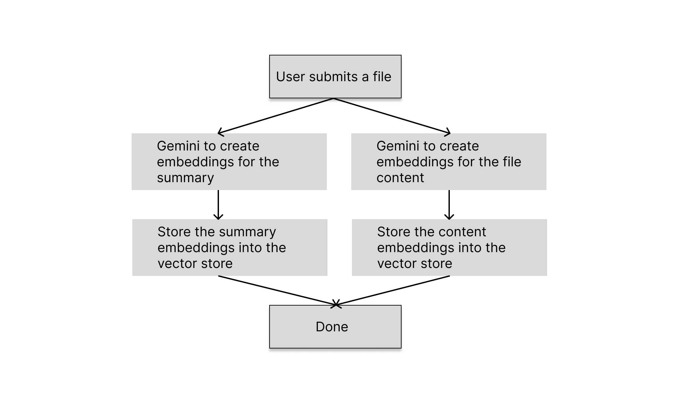
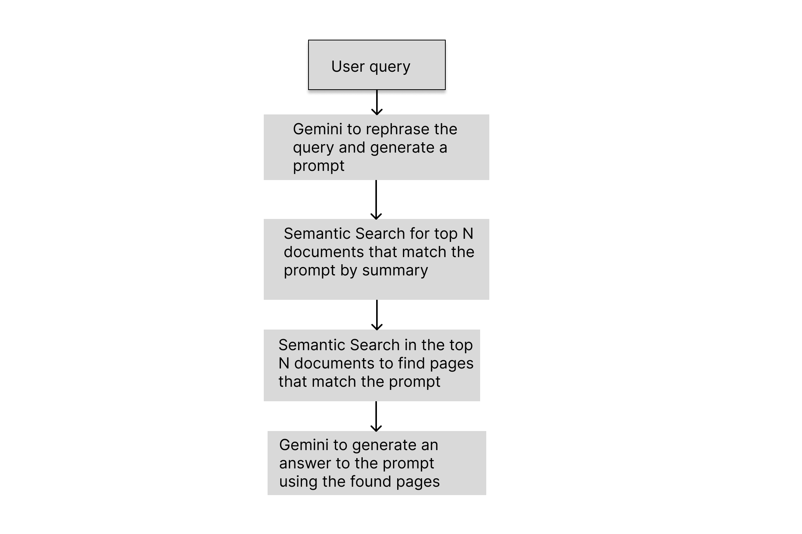

# Climate Mate

Climate Mate is a RAG application that utilizes Google AI (Gemini) to respond to user questions on the topic of climate change and generate embedding vectors for use in semantic search. The software relies on data from trusted sources such as NASA and the Intergovernmental Panel on Climate Change (IPCC).

## Try it

Navigate to [http://www.climate-mate.org](http://www.climate-mate.org) and try asking questions on climate change topic. There are some prebuilt quick questions for you to try too.

## Workflows

### Upload document

### Query

## Exposed endpoints

[POST] http://www.climate-mate.org/v1/upload\
This is protected endpoint. The one used to upload and index the file, where the request body is multipart form with two fields - `file` (bin) and `summary` (string)

[GET] http://www.climate-mate.org/v1/query\
Query endpoint is used to return an answer to the user's question.\
Arguments:

- `required` q - the user question. For example: `?q="what is climate change?"`
- `optional` searchby - strategy used search in indexed documents. Supports two options: `top` (default) and `wide`. Here `top` picks the top N pages by score, whereas `wide` takes top N/(number of files) from each file to form a final list.

[GET] http://www.climate-mate.org/v1/search\
Semantic search in vectore store by user input.\
Arguments:

- `required` q - same as in `query`
- `optional` searchby - same as in `query`
- `optional` n - number of pages to return (default - 10).
